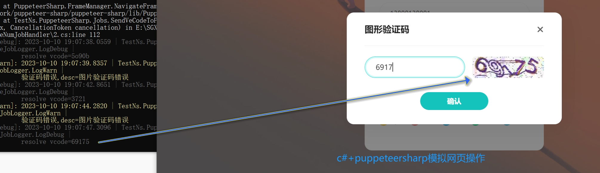
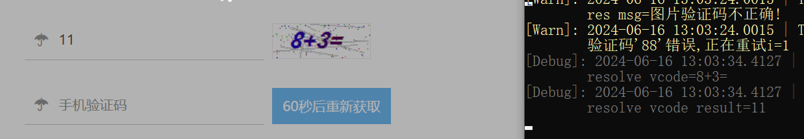
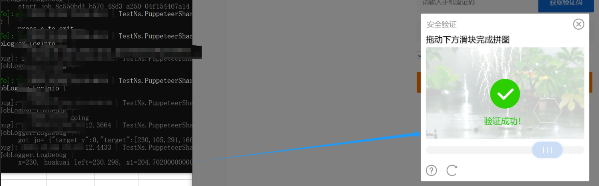
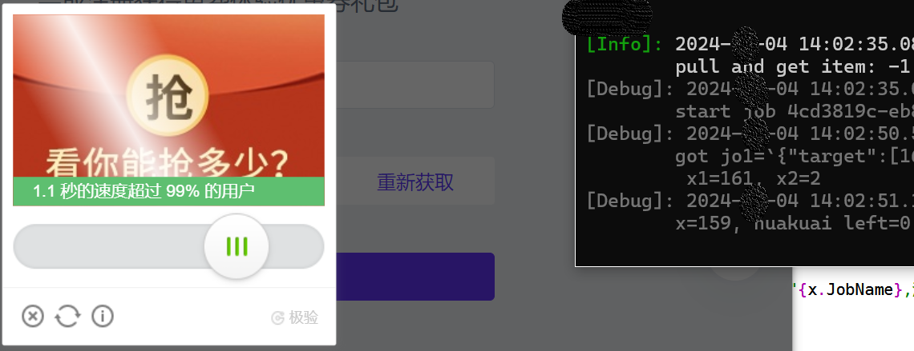
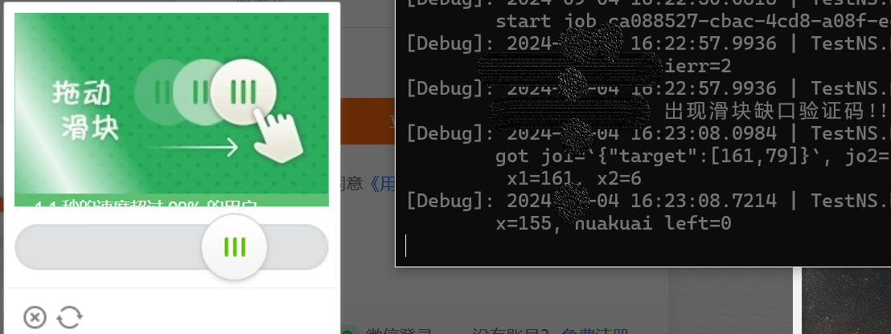
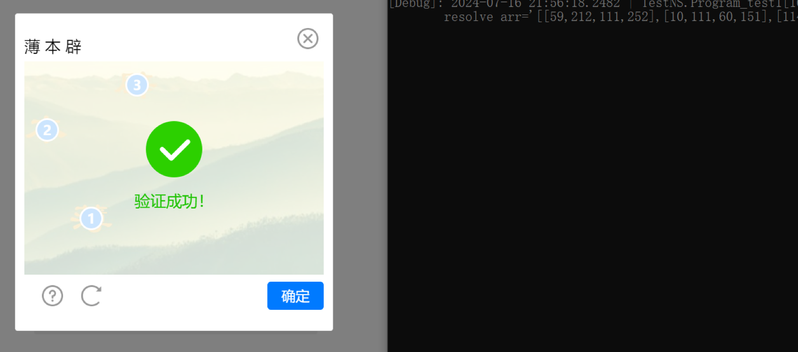

效果如下：

* 一般图片

* 简单的图片数学运算

* 一般滑块缺口

* 滑块缺口 - 极验1

|  |  |
| ------------------------------------------------------------ | ------------------------------------------------------------ |

* 一般文字点选

